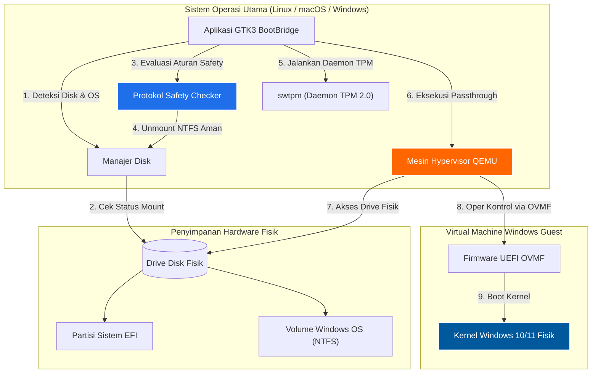

<div align="center">


# BootBridge

### *Aplikasi Virtualisasi Dual-Boot Fisik yang Ringan, Aman & Zero-Reboot*

[](LICENSE)
[](https://www.python.org/)
[](https://www.gtk.org/)
[](https://www.qemu.org/)
[](https://github.com/dreamzz2nd/BootBridge)

<p align="center">
  <b>Bahasa / Languages:</b> <a href="README.md">English</a> | <b><a href="README.id.md">Bahasa Indonesia</a></b>
</p>

<p align="center">
  <a href="https://github.com/dreamzz2nd/BootBridge/releases/download/v1.0.0/BootBridge-v1.0.0-Windows-Package.zip">
    
  </a>
  <a href="https://github.com/dreamzz2nd/BootBridge/releases/download/v1.0.0/BootBridge-v1.0.0-macOS-Package.zip">
    
  </a>
  <a href="https://github.com/dreamzz2nd/BootBridge/releases/download/v1.0.0/BootBridge-v1.0.0-Linux-x64-Package.tar.gz">
    
  </a>
  <a href="https://github.com/dreamzz2nd/BootBridge/releases/tag/v1.0.0">
    
  </a>
</p>

<p align="center">
  <b>BootBridge</b> adalah aplikasi desktop khusus yang dirancang untuk menjalankan sistem operasi Windows dual-boot fisik kamu secara aman di dalam Virtual Machine (QEMU dengan akselerasi hardware native) langsung dari desktop—<b>tanpa perlu merestart (reboot) komputer kamu</b>.
</p>

[Fitur Utama](#fitur-utama) •
[Dukungan Lintas Platform](#dukungan-lintas-platform) •
[Panduan Instalasi](#panduan-instalasi) •
[Remote Desktop](#fitur-remote-desktop-sederhana) •
[Matriks Perbandingan](#matriks-perbandingan) •
[Troubleshooting](#troubleshooting--faq)

</div>

---

## Daftar Isi

- [Gambaran Umum](#gambaran-umum)
- [Fitur Utama](#fitur-utama)
- [Dukungan Lintas Platform](#dukungan-lintas-platform)
- [Panduan Instalasi](#panduan-instalasi)
  - [Opsi A: Installer Visual GUI 1-Klik (Tanpa Terminal / Untuk Awam)](#opsi-a-installer-visual-gui-1-klik-tanpa-terminal--untuk-awam)
  - [Opsi B: Perintah Terminal Otomatis 1-Baris](#opsi-b-perintah-terminal-otomatis-1-baris)
  - [Opsi C: Instalasi Manual](#opsi-c-instalasi-manual)
- [Fitur Remote Desktop Sederhana](#fitur-remote-desktop-sederhana)
- [Matriks Perbandingan](#matriks-perbandingan)
- [Arsitektur Sistem](#arsitektur-sistem)
- [Persyaratan Sistem](#persyaratan-sistem)
- [Panduan Penggunaan](#panduan-penggunaan)
- [Troubleshooting & FAQ](#troubleshooting--faq)
- [Pintasan Keyboard (Shortcuts)](#pintasan-keyboard-shortcuts)
- [Kontribusi & Lisensi](#kontribusi--lisensi)

---

## Gambaran Umum

Secara tradisional, pengguna dual-boot harus mematikan total sistem operasi mereka dan merestart komputer setiap kali ingin mengakses instalasi Windows fisik. **BootBridge** mengeliminasi proses perebutan restart ini dengan memanfaatkan **akselerasi hypervisor hardware native** dan **passthrough block device fisik QEMU**.

Dengan BootBridge, partisi Windows fisik kamu akan di-boot secara native di dalam jendela VM berkecepatan tinggi langsung di atas desktop kamu. Kamu tetap memiliki akses penuh ke seluruh file Windows fisik, game, dan aplikasi yang sudah terinstall, sambil menjalankan sistem operasi utama secara bersamaan.

---

## Fitur Utama

- **Zero-Reboot Dual Booting**: Jalankan drive Windows fisik kamu di dalam sistem operasi utama dengan kecepatan mendekati bare-metal 1:1.
- **Dukungan Lintas Platform**: Mendukung penuh **Linux**, **macOS** (Intel & Apple Silicon M1-M4), dan **Windows**.
- **Installer Visual GUI 1-Klik**: Cukup klik 2x `Install_BootBridge.desktop` atau jalankan `gui_installer.py` untuk wizard instalasi visual tanpa terminal.
- **Fitur Remote Desktop Sederhana**: Fitur koneksi remote desktop 7-langkah intuitif dengan ID perangkat unik otomatis, tombol salin IP 1-klik, pemindai jaringan Wi-Fi otomatis, dan tombol sambungkan instan.
- **Mount Safety Guard**: Protokol perlindungan internal yang memverifikasi status mount disk, memberi peringatan terhadap akses partisi terbagi, dan melepas (unmount) drive NTFS terikat secara aman untuk mencegah kerusakan data.
- **Fast Startup & Modifier Registry Offline**: Pengubah registry offline satu-klik untuk mengatur status Fast Startup Windows (`HiberbootEnabled = 1`) tanpa merusak filesystem.
- **Perlindungan Jendela Frameless**: Jendela tampilan QEMU berjalan dalam mode frameless (tanpa tombol close) untuk mencegah VM terhenti secara tidak sengaja.
- **Shared Clipboard Dua Arah**: Integrasi `qemu-vdagent` internal untuk copy-paste teks (`Ctrl+C` / `Ctrl+V`) dua arah antara host dan VM Windows.
- **100% Gratis & Sangat Ringan**: Dibangun murni dengan Python 3 & GTK 3 (penggunaan RAM hanya ~30–50 MB, 0% CPU idle footprint). Tanpa runtime web/Electron yang berat.

---

## Dukungan Lintas Platform

BootBridge dirancang untuk berjalan lancar di semua sistem operasi desktop utama dengan akselerasi hardware native:

| Sistem Operasi | Mesin Akselerasi Hypervisor | Antarmuka Penyimpanan | Client Remote Desktop |
| :--- | :--- | :--- | :--- |
| **Linux** (Ubuntu, Debian, Fedora, Arch, Mint) | **KVM** (`-accel kvm`) | `/dev/nvme*` atau `/dev/sd*` | `xfreerdp` / `spicy` |
| **macOS** (Intel & Apple Silicon M1/M2/M3/M4) | **HVF** (`-accel hvf`) | `/dev/disk*` | `freerdp` / `remote-viewer` |
| **Windows** (Windows 10 & Windows 11) | **WHPX** (`-accel whpx`) | `\\.\PhysicalDrive*` | Bawaan Native `mstsc.exe` |

---

## Panduan Instalasi

### Opsi A: Installer Visual GUI 1-Klik (Tanpa Terminal / Untuk Awam)

1. Unduh & Ekstrak folder repository atau file ZIP BootBridge.
2. Klik 2x pada file **`Install_BootBridge.desktop`** di dalam folder.
3. Jendela **BootBridge Setup Wizard** akan muncul di layar:
   - Pilih Sistem Operasi kamu (Linux, Windows, atau macOS).
   - Klik tombol **`Install Sekarang`**.
4. Wizard akan secara otomatis mengunduh komponen pendukung, mendaftarkan shortcut di menu desktop, dan menjalankan BootBridge!

---

### Opsi B: Perintah Terminal Otomatis 1-Baris

Buka terminal kamu, salin, dan jalankan 1 perintah ini:

```bash
git clone https://github.com/dreamzz2nd/BootBridge.git && cd BootBridge && ./install.sh
```

---

### Opsi C: Instalasi Manual

#### 1. Install Komponen Pendukung Sistem

* **Ubuntu / Linux Mint / Debian**:
  ```bash
  sudo apt update && sudo apt install -y qemu-system-x86-64 ovmf qemu-utils swtpm freerdp2-x11 spice-client-gtk python3-gi
  ```
* **macOS (via Homebrew)**:
  ```bash
  brew install gtk+3 gobject-introspection qemu freerdp
  ```
* **Arch Linux / Manjaro**:
  ```bash
  sudo pacman -S --needed qemu-desktop ovmf qemu-img swtpm freerdp python-gobject
  ```
* **Fedora**:
  ```bash
  sudo dnf install -y qemu-system-x86 edk2-ovmf qemu-img swtpm freerdp python3-gobject
  ```

#### 2. Jalankan BootBridge
```bash
git clone https://github.com/dreamzz2nd/BootBridge.git
cd BootBridge
./start.sh
```

---

## Fitur Remote Desktop Sederhana

BootBridge dilengkapi dengan fitur koneksi Remote Desktop 7-langkah yang sangat mudah digunakan:

```
+-----------------------------------------------------------------------------+
|  BootBridge Remote Desktop                                                 |
+-----------------------------------------------------------------------------+
|  [ID Komputer Anda / My ID]  192.168.1.15         [ Salin ID / Copy ]       |
+-----------------------------------------------------------------------------+
|  ID Komputer Partner:       [ 192.168.1.100                    ]          |
|  Komputer Terdeteksi Wi-Fi: [ LAPTOP-WINDOWS (192.168.1.100) v ] [ Pindai ] |
+-----------------------------------------------------------------------------+
|  [ SAMBUNGKAN SEKARANG (1-KLIK) ]                                           |
+-----------------------------------------------------------------------------+
```

### Alur Kerja Remote Desktop 7-Langkah:

1. **Langkah 1 & 2 (Pemasangan Otomatis Komponen)**: BootBridge memeriksa ketersediaan client remote saat aplikasi dibuka. Komponen yang belum ada bisa dipasang otomatis dengan 1 klik.
2. **Langkah 3 (ID Perangkat Anda)**: ID / Alamat IP unik kamu ditampilkan di banner atas lengkap dengan tombol **Salin ID** 1-klik untuk dibagikan.
3. **Langkah 4 (Koneksi ke Perangkat Remote - Attended Access)**: Masukkan ID / IP komputer tujuan (atau klik **Pindai Wi-Fi** untuk menemukan PC Windows di sekitar) lalu klik **SAMBUNGKAN SEKARANG**.
4. **Langkah 5 (Pengaturan Unattended Access)**: Simpan kredensial login Windows target untuk terhubung kapan saja tanpa butuh persetujuan manual di sisi target.
5. **Langkah 6 (Kontrol Penuh)**: Dapatkan kontrol mouse, keyboard, clipboard copy-paste dua arah, passthrough audio, dan penyesuaian resolusi layar secara dinamis.
6. **Langkah 7 (Keamanan Terenkripsi)**: Seluruh koneksi remote desktop dienkripsi dan terlindungi.

---

## Matriks Perbandingan

| Fitur | Dual-Boot Restart Fisik | Virtual Machine Standar | BootBridge |
| :--- | :---: | :---: | :---: |
| **Perlu Reboot / Restart** | Ya | Tidak | **Tidak** |
| **Menggunakan Windows Fisik Terinstall**| Ya | Tidak (Perlu install OS ulang) | **Ya** |
| **Performa** | 100% Native | 60% - 80% Virtualized | **90% - 98% Mendekati Native** |
| **Dukungan Lintas Platform** | N/A | Ya | **Ya (Linux, macOS, Windows)** |
| **Perlindungan Keamanan Disk** | Tidak Ada | N/A | **Automated Mount Protection Guard** |
| **Fitur Remote Desktop** | Tidak Ada | Terbatas | **Modul Remote 7-Langkah Praktis** |
| **Penggunaan Memory (RAM)** | N/A | 500 MB+ (Web wrapper) | **~30 – 50 MB (GTK3 Native)** |

---

## Arsitektur Sistem



---

## Persyaratan Sistem

| Komponen | Spesifikasi Minimum | Spesifikasi Direkomendasikan |
| :--- | :--- | :--- |
| **Sistem Operasi Host** | Linux, macOS (10.15+), atau Windows 10/11 | Linux Mint, Ubuntu 22.04+, macOS 12+, Windows 11 |
| **Virtualisasi CPU** | Intel VT-x atau AMD-V aktif di BIOS/UEFI | CPU 4+ Cores dengan Hardware Virtualization |
| **Memori Utama (RAM)** | 8 GB Total RAM Sistem | 16 GB+ Total RAM Sistem |
| **Antarmuka Penyimpanan** | Setup Dual-Boot SATA SSD / HDD | Setup Dual-Boot NVMe M.2 SSD |

---

## Panduan Penggunaan

1. **Jalankan BootBridge**:
   Jalankan `./start.sh` atau klik 2x pada file **`Install_BootBridge.desktop`**.

2. **Pilih Disk Fisik Target**:
   Pilih drive fisik yang berisi instalasi Windows kamu di menu dropdown **Target Disk**.

3. **Verifikasi Status Safety Guard**:
   - Jika partisi NTFS sedang di-mount oleh Linux, klik **`Unmount Partisi Linux Secara Aman`**.
   - Jika Windows terkunci oleh Fast Startup, klik **`Reset Status NTFS / Fast Startup`**.

4. **Jalankan VM**:
   Klik **`MULAI VM WINDOWS`**. Jendela VM akan langsung memuat desktop Windows fisik kamu.

---

## Troubleshooting & FAQ

### 1. Mematikan / Mengaktifkan Windows Fast Startup

> [!IMPORTANT]
> Ketika Windows dimatikan secara fisik dengan fitur **Fast Startup** aktif, Windows akan menghibernasi kernel dan mengunci filesystem NTFS. Memboot QEMU saat status terhibernasi akan memaksa Windows masuk ke dalam loop *Automatic Repair*.

**Solusi:**
- Gunakan tombol internal **`Reset Status NTFS / Fast Startup`** di BootBridge untuk membersihkan kunci hibernasi.
- Atau boot ke Windows fisik dan jalankan perintah `powercfg /h off` di Command Prompt (CMD) sebagai Administrator.

---

## Pintasan Keyboard (Shortcuts)

| Pintasan | Fungsi | Keterangan |
| :--- | :--- | :--- |
| **`Ctrl + Alt + F`** | **Toggle Fullscreen VM** | Berpindah antara mode jendela dan mode layar penuh VM |
| **`Ctrl + Alt + G`** | **Lepas / Tangkap Fokus** | Melepas atau menangkap fokus kursor mouse dan keyboard |
| **`F11`** | **Fullscreen Jendela Utama** | Mengubah mode layar penuh jendela aplikasi BootBridge |
| **`Ctrl + C` / `Ctrl + V`** | **Shared Clipboard** | Copy dan paste teks dua arah antara Host dan VM |
| **`Super / Tombol Windows`** | **Menu Start Windows** | Ditangkap langsung oleh Start Menu Windows VM saat jendela aktif |

---

## Kontribusi & Lisensi

Kontribusi sangat disambut! Silakan baca [CONTRIBUTING.md](CONTRIBUTING.md) untuk detail pengiriman Pull Request.

### Lisensi

Proyek ini dilesensikan di bawah **Lisensi MIT** - lihat file [LICENSE](LICENSE) untuk detailnya.

---

<div align="center">

Dikembangkan oleh **[Rizky Ibrahim Nasrullah (dreamzz2nd)](https://github.com/dreamzz2nd)**

*BootBridge adalah aplikasi independen open-source.*

</div>
