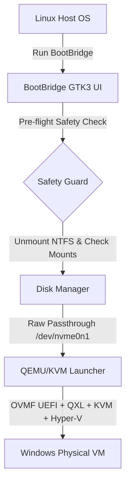

# 🌁 BootBridge

> **Safe, Lightweight & Zero-Reboot Dual-Boot Physical Windows Launcher for Linux**

[](LICENSE)
[](https://www.python.org/)
[](https://www.gtk.org/)
[](https://www.qemu.org/)

BootBridge is a Linux desktop application that allows you to run your existing **physical dual-booted Windows installation inside a Virtual Machine (QEMU/KVM)** directly from your Linux desktop—without restarting your PC.

---

## ✨ Features

- 🚀 **Zero-Reboot Dual Booting**: Launch your physical Windows disk inside Linux at near-native speed.
- 🛡️ **Mount Safety Guard**: Prevents data corruption by automatically checking and unmounting Linux-mounted NTFS partitions before booting.
- ⚙️ **KVM & Hyper-V Acceleration**: Utilizes KVM hardware acceleration with full Hyper-V CPU enlightenments (`hv_relaxed`, `hv_spinlocks`, `hv_vapic`, `hv_time`, etc.) for rock-solid stability.
- 🖥️ **QXL Paravirtualized Graphics**: High-performance 2D/3D graphics with out-of-the-box OVMF UEFI GOP compatibility (no static/glitch lines).
- 📊 **Auto-Calculated Hardware Recommendations**: Automatically detects system RAM and CPU core count, setting optimal safe values with visual scale markers (`⭐ Recommended`).
- ⚡ **One-Click NTFS Repair (`ntfsfix`)**: Integrated utility to clear dirty volume flags and Fast Startup hibernation locks.
- 🔒 **TPM 2.0 Emulator (`swtpm`)**: Fully compatible with Windows 11 TPM requirements.
- 🖥️ **Fullscreen Mode & Keyboard Shortcuts**: Instant fullscreen toggle (`Ctrl + Alt + F`) and mouse release (`Ctrl + Alt + G`).

---

## 🏗️ Architecture Overview



---

## 📋 Prerequisites & Installation

### 1. System Dependencies

BootBridge requires QEMU, OVMF firmware, `qemu-utils`, and `swtpm` (for Windows 11 TPM).

**Ubuntu / Linux Mint / Debian:**
```bash
sudo apt update
sudo apt install -y qemu-system-x86-64 ovmf qemu-utils swtpm python3-gi python3-gi-cairo
```

**Fedora:**
```bash
sudo dnf install qemu-system-x86 edk2-ovmf swtpm python3-gobject
```

**Arch Linux:**
```bash
sudo pacman -S qemu-desktop ovmf swtpm python-gobject
```

### 2. Clone Repository

```bash
git clone https://github.com/dreamzz2nd/BootBridge.git
cd BootBridge
```

---

## 🚀 Quick Start

1. Make the startup script executable and launch BootBridge:
   ```bash
   chmod +x start.sh
   ./start.sh
   ```

2. Select your physical drive containing the dual-boot Windows installation from the dropdown menu (e.g. `/dev/nvme0n1` or `/dev/sda`).

3. Check the **Safety & Data Protection Guard**:
   - If NTFS partitions are mounted, click **🔓 Safe Unmount Linux Partitions**.
   - If Windows was hibernated, click **⚡ Reset Status NTFS / Fast Startup**.

4. Adjust RAM and CPU allocations (or keep the auto-detected **⭐ Recommended** values).

5. Click **▶ START WINDOWS VM**.

---

## 💡 Troubleshooting & Important Tips

### 1. Disabling Windows Fast Startup (Recommended)
When Windows is shut down physically with **Fast Startup** enabled, it leaves the NTFS partition hibernated.
To disable Fast Startup permanently:
1. Boot into physical Windows natively once.
2. Open **Command Prompt as Administrator** and execute:
   ```cmd
   powercfg /h off
   ```
3. Shut down Windows cleanly (**Shutdown**, not Sleep/Hibernate).

### 2. Resolving "Preparing Automatic Repair" Loop
If Windows enters *Preparing Automatic Repair* on the first boot:
1. On the repair screen, click **Advanced options** → **Troubleshoot** → **Startup Settings** → **Restart**.
2. Press **4** or **F4** to select **Enable Safe Mode**.
3. Once Windows boots into Safe Mode inside QEMU, kernel drivers will automatically re-align with QEMU virtual hardware.
4. Restart the VM, and Windows will boot normally into desktop mode.

---

## ⌨️ Useful Keyboard Shortcuts in VM

| Shortcut | Description |
| :--- | :--- |
| **`Ctrl + Alt + F`** | Toggle **Fullscreen Mode** on / off |
| **`Ctrl + Alt + G`** | Grab / Release Mouse and Keyboard input focus |
| **`View → Zoom to Fit`** | Auto-scale VM screen resolution to window size |
| **`Machine → Send Key`** | Send `Ctrl+Alt+Del` signal to Windows VM |
| **`Machine → Reset`** | Perform a hard reset if Windows hangs |

---

## 🛠️ Built With

- **Python 3** - Core application logic
- **GTK3 (PyGObject)** - Native Linux graphical user interface
- **QEMU / KVM** - Hypervisor and hardware acceleration engine
- **OVMF (EDK II)** - UEFI Firmware implementation
- **swtpm** - TPM 2.0 Software Emulator

---

## 📄 License

This project is licensed under the MIT License - see the [LICENSE](LICENSE) file for details.
