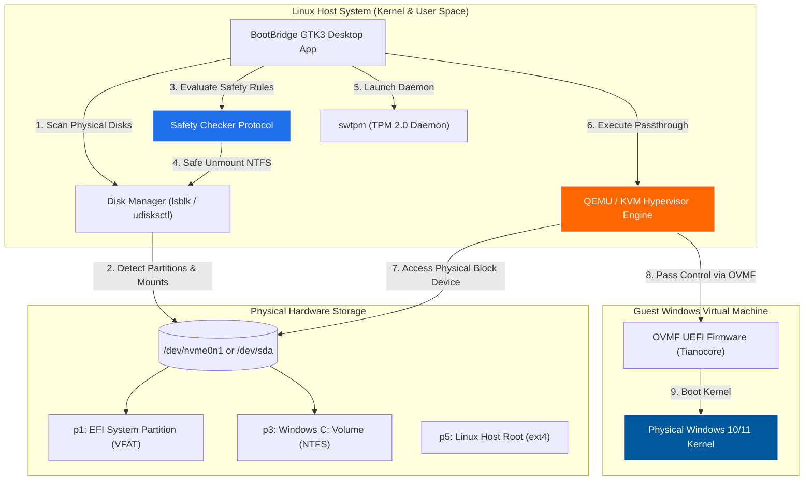

<div align="center">


# BootBridge

### *Lightweight, Safe & Zero-Reboot Physical Dual-Boot Launcher for Linux*

[](LICENSE)
[](https://www.python.org/)
[](https://www.gtk.org/)
[](https://www.qemu.org/)
[](https://github.com/tianocore/tianocore.github.io/wiki/OVMF)
[](https://www.kernel.org/)

<p align="center">
  <b>BootBridge</b> is a specialized Linux desktop application designed to safely run your existing physical dual-booted Windows installation inside a Virtual Machine (QEMU/KVM) directly from your Linux desktop—<b>without rebooting your computer</b>.
</p>

[Key Features](#key-features) •
[Comparison](#comparison-matrix) •
[Architecture](#system-architecture) •
[Installation](#installation-guide) •
[Usage Guide](#usage-guide) •
[Troubleshooting](#troubleshooting--faq)

</div>

---

## Table of Contents

- [Overview](#overview)
- [Key Features](#key-features)
- [Comparison Matrix](#comparison-matrix)
- [System Architecture](#system-architecture)
- [System Requirements](#system-requirements)
- [Installation Guide](#installation-guide)
  - [1. Install Dependencies](#1-install-system-dependencies)
  - [2. Clone & Setup](#2-clone--setup-repository)
  - [3. Desktop Menu Integration](#3-optional-desktop-menu-integration)
- [Usage Guide](#usage-guide)
- [Troubleshooting & FAQ](#troubleshooting--faq)
  - [Disabling / Enabling Windows Fast Startup](#1-disabling--enabling-windows-fast-startup)
  - [Fixing "Preparing Automatic Repair"](#2-fixing-preparing-automatic-repair)
- [Keyboard Shortcuts Reference](#keyboard-shortcuts-reference)
- [Contributing & License](#contributing--license)

---

## Overview

Traditionally, dual-boot users must completely shut down Linux and restart their computer to access their Windows installation. **BootBridge** eliminates this workflow friction by leveraging **Linux KVM (Kernel-based Virtual Machine)** and **QEMU raw block device passthrough**.

With BootBridge, your physical Windows partition is booted natively inside a high-performance VM window on your Linux desktop. You retain full access to your physical Windows files, installed games, and applications while running Linux simultaneously.

---

## Key Features

- **Zero-Reboot Dual Booting**: Boot your physical Windows drive inside Linux at near-native speed.
- **Mount Safety Guard**: Built-in protection protocol that verifies disk mount states, warns against shared host partition access, and safely unmounts Linux-mounted NTFS drives to prevent data corruption.
- **Fast Startup & Offline Registry Modifier**: One-click Fast Startup enablement (`HiberbootEnabled = 1`) and reset via direct offline REGF Windows registry hive modification.
- **Frameless Window Protection**: QEMU display window runs frameless (no titlebar, menu bar, or close button) to prevent accidental VM termination.
- **Direct Windows Logo Key Capture**: Intercepts and routes the Windows/Super key directly to the Windows VM Start Menu when focused.
- **Bidirectional Shared Clipboard**: Built-in `qemu-vdagent` integration for seamless text copy and paste (`Ctrl+C` / `Ctrl+V`) between Linux host and Windows VM.
- **Mutually Exclusive Smart Button States**: Dynamic button state indicators (Orange for ready-to-use actions, Gray for applied/active states) with automatic persistence across app launches in `config.json`.
- **Modular Clean Architecture**: Highly structured Python codebase separated into `core/`, `ui/`, `ui/pages/`, and `ui/components.py` for maximum maintainability.
- **KVM & Hyper-V Acceleration**: Configures KVM hardware virtualization with a comprehensive suite of Hyper-V CPU enlightenments (`hv_relaxed`, `hv_spinlocks`, `hv_vapic`, `hv_time`, `hv_synic`, `hv_stimer`, `hv_reset`, `hv_vpindex`, `hv_runtime`, `hv_tlbflush`, `hv_ipi`) to prevent Windows kernel timer desynchronization and BSODs.
- **QXL Paravirtualized Graphics**: Employs QXL graphics acceleration for flawless OVMF UEFI GOP framebuffer rendering without visual artifacts or stride glitches.
- **Hardware Auto-Recommendation**: Dynamically analyzes host total RAM and CPU core count, calculating optimal safe default allocations with visual scale markers (`Recommended`).
- **TPM 2.0 Emulator (`swtpm`)**: Automatic integration with `swtpm` daemon for full Windows 11 compatibility.
- **Fullscreen Mode & Interactive Shortcuts**: One-click direct fullscreen mode and interactive keyboard shortcut reference (`Ctrl + Alt + F` / `Ctrl + Alt + G`).

---

## Comparison Matrix

| Feature | Native Reboot Dual-Boot | Standard VirtualBox / VMware | BootBridge (QEMU/KVM Passthrough) |
| :--- | :---: | :---: | :---: |
| **Reboot Required** | Yes | No | **No** |
| **Uses Physical Installed Windows**| Yes | No (Requires duplicate OS install) | **Yes** |
| **Performance** | 100% Native | 60% - 80% Virtualized | **90% - 98% Near-Native** |
| **Data Synchronization** | Manual / Dual Boot | Guest Additions | **Native Direct Storage Access** |
| **Data Safety Protection** | None | N/A | **Automated Mount Protection Guard** |
| **Hyper-V Enlightenments** | N/A | Limited | **Full KVM Hyper-V Suite** |

---

## System Architecture



---

## System Requirements

| Component | Minimum Specification | Recommended Specification |
| :--- | :--- | :--- |
| **Host Operating System** | Any modern 64-bit Linux distribution | Linux Mint, Ubuntu 22.04+, Fedora 38+, Arch Linux |
| **CPU Virtualization** | Intel VT-x or AMD-V enabled in BIOS/UEFI | 4+ Cores CPU with Hardware Virtualization |
| **System Memory (RAM)** | 8 GB Total System RAM | 16 GB+ Total System RAM |
| **Storage Interface** | SATA SSD or HDD Dual-Boot Setup | NVMe M.2 SSD Dual-Boot Setup |
| **Required Packages** | `qemu-system-x86_64`, `ovmf`, `qemu-utils` | `qemu-system-x86-64`, `ovmf`, `qemu-utils`, `swtpm` |

---

## Installation Guide

### 1. Install System Dependencies

Select your Linux distribution package manager to install the required virtualization stack:

#### Ubuntu / Linux Mint / Pop!_OS / Debian
```bash
sudo apt update
sudo apt install -y qemu-system-x86-64 ovmf qemu-utils swtpm python3-gi python3-gi-cairo
```

#### Fedora / RHEL
```bash
sudo dnf install -y qemu-system-x86 edk2-ovmf qemu-img swtpm python3-gobject
```

#### Arch Linux / Manjaro
```bash
sudo pacman -S --needed qemu-desktop ovmf qemu-img swtpm python-gobject
```

#### openSUSE
```bash
sudo zypper install qemu-x86 qemu-ovmf-x86_64 swtpm python3-gobject
```

---

### 2. Clone & Setup Repository

```bash
# Clone BootBridge repository
git clone https://github.com/dreamzz2nd/BootBridge.git
cd BootBridge

# Grant execution permission to launcher script
chmod +x start.sh
```

---

### 3. (Optional) Desktop Menu Integration

To integrate BootBridge into your Linux application launcher menu (Desktop Application Shortcut):

```bash
# Create desktop entry directory if needed
mkdir -p ~/.local/share/applications

# Copy launcher file
cp desktop/bootbridge.desktop ~/.local/share/applications/

# Update desktop database
update-desktop-database ~/.local/share/applications/
```

---

## Usage Guide

1. **Launch BootBridge**:
   Run the launcher script from terminal or click **BootBridge** in your application launcher menu:
   ```bash
   ./start.sh
   ```

2. **Select Target Physical Disk**:
   Choose the physical drive containing your Windows installation from the **Target Disk** dropdown menu (e.g., `/dev/nvme0n1` or `/dev/sda`).

3. **Verify Safety Guard Status**:
   - If NTFS partitions are currently mounted by Linux, click **`Safe Unmount Linux Partitions`**.
   - If Windows was hibernated or locked by Fast Startup, click **`Reset Status NTFS / Fast Startup`**.
   - To re-enable Fast Startup for native dual-booting, click **`Enable Fast Startup`**.

4. **Review Hardware Allocation**:
   - BootBridge automatically sets the **Recommended** RAM allocation (e.g. 3 GB for 8 GB systems) and CPU cores to keep your Linux host system responsive.

5. **Launch VM**:
   Click **`START WINDOWS VM`**. The QEMU window will open and boot into your physical Windows desktop.

---

## Troubleshooting & FAQ

### 1. Disabling / Enabling Windows Fast Startup

> [!IMPORTANT]
> When Windows is shut down physically with **Fast Startup** enabled, Windows hibernates the kernel to `hiberfil.sys` and locks the NTFS filesystem. Booting QEMU with a hibernated physical hardware state forces Windows into an Automatic Repair boot loop.

**Resolution:**
- Use the built-in **`Reset Status NTFS / Fast Startup`** button in BootBridge to automatically clear hibernation volume locks.
- Alternatively, boot into physical Windows and run `powercfg /h off` in CMD as Administrator.
- When you want to return to native Windows fast booting, click **`Enable Fast Startup`** in BootBridge.

---

### 2. Fixing "Preparing Automatic Repair"

If Windows enters *Preparing Automatic Repair* on the first launch inside QEMU:

```
[Automatic Repair Screen] -> Advanced options -> Troubleshoot -> Startup Settings -> Restart -> Press 4 (Enable Safe Mode)
```

1. On the repair screen, click **Advanced options** -> **Troubleshoot** -> **Startup Settings** -> **Restart**.
2. Press **`4`** or **`F4`** on your keyboard to select **Enable Safe Mode**.
3. Once Windows boots into Safe Mode inside QEMU, Windows automatically adjusts its kernel drivers for QEMU virtual hardware.
4. Restart the VM from within Windows, and it will boot normally into full desktop mode.

---

### 3. Troubleshooting Matrix

| Issue | Potential Cause | Solution |
| :--- | :--- | :--- |
| **Vertical static lines / Glitch graphics** | Stride mismatch in legacy `std` VGA driver with UEFI | Select **Native GTK Window (QXL 2D/3D)** in Display Engine |
| **INACCESSIBLE_BOOT_DEVICE (BSOD 0x7B)** | Missing legacy IDE controller drivers | BootBridge automatically uses **AHCI SATA** / **NVMe** passthrough |
| **System Heavy Lag / 90%+ RAM Usage** | VM RAM allocation set too high for host system | Set RAM Allocation to the **`Recommended`** marker (e.g., 3 GB) |
| **Windows 11 TPM Error** | Missing TPM 2.0 module | Install `swtpm` package (`sudo apt install swtpm`) |

---

## Keyboard Shortcuts Reference

When the QEMU VM window is focused, use the following shortcuts for seamless interactivity:

| Shortcut | Function | Description |
| :--- | :--- | :--- |
| **`Ctrl + Alt + F`** | **Toggle Fullscreen** | Switches between windowed and full-screen mode instantly |
| **`Ctrl + Alt + G`** | **Release / Grab Focus** | Releases mouse cursor and keyboard focus back to Linux host or captures it back |
| **`Ctrl + C` / `Ctrl + V`** | **Shared Clipboard** | Bidirectional text copy and paste between Linux Host and Windows VM |
| **`Super / Windows Key`** | **Windows Start Menu** | Captured directly by Windows VM Start Menu when window is focused |
| **`Machine -> Send Key`** | **Send System Keys** | Sends `Ctrl+Alt+Del`, `PrintScreen`, or `Pause` commands to Windows |
| **`Machine -> Reset`** | **Hard Reset** | Performs an emergency hardware reset if Windows freezes |

---

## Contributing & License

Contributions are welcome! Please read [CONTRIBUTING.md](CONTRIBUTING.md) for details on submitting pull requests and reporting issues.

### License

This project is licensed under the **MIT License** - see the [LICENSE](LICENSE) file for details.

---

<div align="center">

Developed by **[Rizky Ibrahim Nasrullah (dreamzz2nd)](https://github.com/dreamzz2nd)**

*BootBridge is an independent open-source tool and is not affiliated with Microsoft Corporation or QEMU/KVM maintainers.*

</div>
