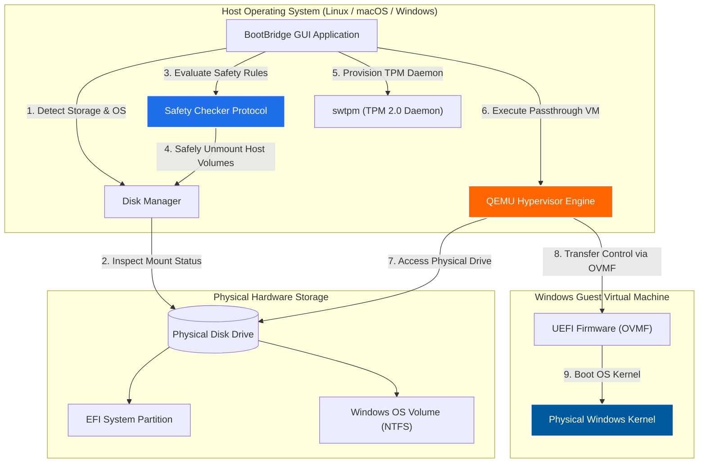

<div align="center">


# BootBridge

### *Lightweight, Safe & Zero-Reboot Physical Dual-Boot Virtualization*

[](LICENSE)
[](https://www.python.org/)
[](https://www.gtk.org/)
[](https://www.qemu.org/)
[](https://github.com/dreamzz2nd/BootBridge)

<p align="center">
  <b>Languages / Bahasa:</b> <b><a href="README.md">English</a></b> | <a href="README.id.md">Bahasa Indonesia</a>
</p>

<p align="center">
  <a href="https://github.com/dreamzz2nd/BootBridge/releases/download/v1.0.0/BootBridge-v1.0.0-Windows-Setup.exe">
    
  </a>
  <a href="https://github.com/dreamzz2nd/BootBridge/releases/download/v1.0.0/BootBridge-v1.0.0-macOS.dmg">
    
  </a>
  <a href="https://github.com/dreamzz2nd/BootBridge/releases/download/v1.0.0/bootbridge_1.0.0_all.deb">
    
  </a>
  <a href="https://github.com/dreamzz2nd/BootBridge/releases/tag/v1.0.0">
    
  </a>
  <a href="https://ko-fi.com/dreamzz2nd">
    
  </a>
</p>

<p align="center">
  <b>🌐 <a href="web/index.html">Smart OS Auto-Detect Download Page</a></b> — Automatically detects your operating system and offers the right installer (.exe / .dmg / .deb).
</p>

<p align="center">
  <b>BootBridge</b> is a specialized desktop application designed to safely run your existing physical dual-booted Windows installation inside a Virtual Machine (QEMU with native hardware acceleration) directly from your desktop—<b>without rebooting your computer</b>.
</p>

[Key Features](#key-features) •
[Cross-Platform Support](#cross-platform-support) •
[Installation Guide](#multi-platform-installation-guide) •
[Setup Wizard](#modern-5-step-setup-wizard) •
[Remote Desktop](#easy-remote-desktop-suite) •
[Comparison Matrix](#comparison-matrix) •
[Troubleshooting](#troubleshooting--faq)

</div>

---

## Table of Contents

- [Overview](#overview)
- [Key Features](#key-features)
- [Cross-Platform Support](#cross-platform-support)
- [Multi-Platform Installation Guide](#multi-platform-installation-guide)
  - [1. Microsoft Windows (.exe)](#1-microsoft-windows-exe)
  - [2. Apple macOS (.dmg)](#2-apple-macos-dmg)
  - [3. Linux (.deb & Tarball)](#3-linux-deb--tarball)
  - [4. Automated 1-Line Terminal Command](#4-automated-1-line-terminal-command)
- [Modern 5-Step Setup Wizard](#modern-5-step-setup-wizard)
- [Easy Remote Desktop Suite](#easy-remote-desktop-suite)
- [Comparison Matrix](#comparison-matrix)
- [System Architecture](#system-architecture)
- [System Requirements](#system-requirements)
- [Usage Guide](#usage-guide)
- [Troubleshooting & FAQ](#troubleshooting--faq)
- [Keyboard Shortcuts](#keyboard-shortcuts)
- [Contributing & License](#contributing--license)

---

## Overview

Traditionally, dual-boot users have to shut down their entire workstation and restart the computer every time they need to access their physical Windows installation. **BootBridge** eliminates this constant reboot cycle by leveraging **native hardware hypervisor acceleration** and **QEMU physical block device passthrough**.

With BootBridge, your physical Windows partition is booted inside a hardware-accelerated VM directly inside your primary desktop environment at near 1:1 bare-metal speed.

---

## Key Features

- ⚡ **Zero-Reboot Dual Booting**: Launch your physical Windows drive directly inside your primary OS at near-native 1:1 speed.
- 🌐 **Cross-Platform Native Packages**:
  - **Windows**: `.exe` (Inno Setup Installer) & Standalone binary.
  - **macOS**: Apple Disk Image `.dmg` with `/Applications` drag & drop (Intel & Apple Silicon M1–M4).
  - **Linux**: Debian package `.deb` with system bin `/usr/bin/bootbridge` & desktop integration.
- 🧙 **Modern 5-Step Setup Wizard**: Interactive GUI setup wizard for system diagnostics, hypervisor validation, directory selection, and dependency provisioning.
- 🛡️ **Mount Safety Guard**: Built-in verification protocol that inspects disk mount statuses, warns against split partitions, and safely unmounts host-bound NTFS drives.
- 🔧 **Offline Registry Modifier**: 1-Click offline registry tool to reset Windows Fast Startup hibernated locks (`HiberbootEnabled = 1`) safely.
- 📋 **Bidirectional Shared Clipboard**: Built-in `qemu-vdagent` integration for seamless text copy-paste (`Ctrl+C` / `Ctrl+V`) between host and VM.
- 🖥️ **Easy Remote Desktop Suite**: 7-step remote desktop connection with automatic unique Device ID, 1-click IP copy, and instant Wi-Fi subnet scanning.
- 🪶 **100% Free & Lightweight**: Built with Python 3, GTK 3, and Tkinter (~30–50 MB RAM footprint, 0% idle CPU).

---

## Cross-Platform Support

BootBridge is engineered to run seamlessly across all major desktop operating systems with native hardware acceleration:

| Operating System | Installer Format | Hypervisor Engine | Storage Interface | Remote Desktop Client |
| :--- | :--- | :--- | :--- | :--- |
| **Windows** (10 / 11) | **`.exe`** (Setup Wizard) | **WHPX** (`-accel whpx`) | `\\.\PhysicalDrive*` | Native `mstsc.exe` |
| **macOS** (Intel / M1–M4) | **`.dmg`** (Disk Image) | **HVF** (`-accel hvf`) | `/dev/disk*` | `freerdp` / `remote-viewer` |
| **Linux** (Debian, Ubuntu, Mint, Arch, Fedora) | **`.deb`** / **`.tar.gz`** | **KVM** (`-accel kvm`) | `/dev/nvme*` or `/dev/sd*` | `xfreerdp` / `spicy` |

---

## Multi-Platform Installation Guide

### 1. Microsoft Windows (`.exe`)

1. Download **[BootBridge-v1.0.0-Windows-Setup.exe](https://github.com/dreamzz2nd/BootBridge/releases/download/v1.0.0/BootBridge-v1.0.0-Windows-Setup.exe)**.
2. Double-click the `.exe` file to start the Setup Wizard.
3. Follow the wizard steps to choose installation path and create Desktop / Start Menu shortcuts.
4. Or launch `bootbridge_installer.bat` from the portable ZIP package.

---

### 2. Apple macOS (`.dmg`)

1. Download **[BootBridge-v1.0.0-macOS.dmg](https://github.com/dreamzz2nd/BootBridge/releases/download/v1.0.0/BootBridge-v1.0.0-macOS.dmg)**.
2. Double-click the `.dmg` file to open the disk image.
3. Drag the **BootBridge.app** icon into your **Applications** folder.
4. Launch BootBridge directly from Launchpad or Applications.

---

### 3. Linux (`.deb` & Tarball)

#### Option A: Using the Debian Package (.deb)
```bash
# Download .deb package
wget https://github.com/dreamzz2nd/BootBridge/releases/download/v1.0.0/bootbridge_1.0.0_all.deb

# Install package and dependencies
sudo apt install ./bootbridge_1.0.0_all.deb
```

#### Option B: Using the GUI Setup Wizard
```bash
python3 setup_wizard.py
```

---

### 4. Automated 1-Line Terminal Command

Open your terminal and run:

```bash
git clone https://github.com/dreamzz2nd/BootBridge.git && cd BootBridge && ./install.sh
```

---

## Modern 5-Step Setup Wizard

BootBridge includes an interactive **Setup Wizard** (`setup_wizard.py`) with zero heavy pre-requisite dependencies:

1. **Step 1 (Welcome & Language)**: Switch between English 🇬🇧 and Bahasa Indonesia 🇮🇩 with feature highlights.
2. **Step 2 (System Diagnostics)**: Auto-detects hardware virtualization (KVM, WHPX, HVF), QEMU, and Python.
3. **Step 3 (Destination & Options)**: Select install directory, Desktop Shortcut, Start Menu entry, and PATH options.
4. **Step 4 (Installation Execution)**: Real-time progress bar with expandable live logs.
5. **Step 5 (Finish & Launch)**: Summary of installation and instant application launch.

```bash
# Launch wizard anytime:
python setup_wizard.py
```

---

## Easy Remote Desktop Suite

BootBridge includes an intuitive 7-step Remote Desktop connection module:

```
+-----------------------------------------------------------------------------+
|  BootBridge Remote Desktop                                                 |
+-----------------------------------------------------------------------------+
|  [My Device ID]             192.168.1.15         [ Copy ID ]               |
+-----------------------------------------------------------------------------+
|  Partner Device ID:         [ 192.168.1.100                    ]          |
|  Discovered Wi-Fi Devices:  [ LAPTOP-WINDOWS (192.168.1.100) v ] [ Scan ]   |
+-----------------------------------------------------------------------------+
|  [ CONNECT NOW (1-CLICK) ]                                                 |
+-----------------------------------------------------------------------------+
```

---

## Comparison Matrix

| Feature | Physical Reboot Dual-Boot | Standard Virtual Machine | BootBridge |
| :--- | :---: | :---: | :---: |
| **Requires Reboot** | Yes | No | **No** |
| **Uses Existing Physical Windows** | Yes | No (Requires re-install) | **Yes** |
| **Performance** | 100% Native | 60% - 80% Virtualized | **90% - 98% Near-Native** |
| **Native Installer Packages** | N/A | Limited | **.exe (Win), .dmg (Mac), .deb (Linux)** |
| **Cross-Platform Support** | N/A | Yes | **Yes (Linux, macOS, Windows)** |
| **Disk Safety Guard** | None | N/A | **Automated Mount Protection Guard** |
| **Remote Desktop Suite** | None | Limited | **Built-in 7-Step Remote Module** |
| **Memory Footprint (RAM)** | N/A | 500 MB+ (Web wrapper) | **~30 – 50 MB (Native GTK/Tkinter)** |

---

## System Architecture



---

## System Requirements

| Component | Minimum Specification | Recommended Specification |
| :--- | :--- | :--- |
| **Host OS** | Linux, macOS (10.15+), or Windows 10/11 | Linux Mint, Ubuntu 22.04+, macOS 12+, Windows 11 |
| **CPU Virtualization** | Intel VT-x or AMD-V enabled in BIOS | 4+ Cores with Hardware Virtualization |
| **RAM** | 8 GB System Memory | 16 GB+ System Memory |
| **Storage Interface** | Dual-Boot SATA SSD / HDD | Dual-Boot NVMe M.2 SSD |

---

## Usage Guide

1. **Launch BootBridge**:
   Open via desktop launcher or run `bootbridge` in terminal.

2. **Select Target Physical Disk**:
   Choose the physical drive containing your Windows installation from the **Target Disk** dropdown.

3. **Verify Safety Guard Status**:
   - If NTFS is mounted on host, click **`Safely Unmount Partition`**.
   - If locked by Fast Startup, click **`Reset NTFS / Fast Startup Lock`**.

4. **Start VM**:
   Click **`START WINDOWS VM`**. The VM window will boot into your physical Windows installation.

---

## Troubleshooting & FAQ

### 1. Handling Windows Fast Startup

> [!IMPORTANT]
> When Windows is shut down with **Fast Startup** enabled, it hibernates the kernel and locks the NTFS filesystem. Booting QEMU over a hibernated physical drive triggers Windows Automatic Repair loops.

**Solution:**
- Use the built-in **`Reset NTFS / Fast Startup Lock`** button in BootBridge.
- Or boot into physical Windows and run `powercfg /h off` in Administrator CMD.

---

## Keyboard Shortcuts

| Shortcut | Action | Description |
| :--- | :--- | :--- |
| **`Ctrl + Alt + F`** | **Toggle VM Fullscreen** | Switch between windowed and fullscreen VM mode |
| **`Ctrl + Alt + G`** | **Release / Grab Focus** | Release or grab mouse cursor and keyboard focus |
| **`F11`** | **Main Window Fullscreen** | Toggle fullscreen mode for the main BootBridge window |
| **`Ctrl + C` / `Ctrl + V`** | **Shared Clipboard** | Bidirectional text copy and paste between Host and VM |
| **`Super / Windows Key`** | **Windows Start Menu** | Captured directly by guest Windows VM when active |

---

## Contributing & License

Contributions are very welcome! Please review [CONTRIBUTING.md](CONTRIBUTING.md) for pull request guidelines.

### License

This project is licensed under the **MIT License** - see [LICENSE](LICENSE) for details.

---

<div align="center">

Developed by **[Rizky Ibrahim Nasrullah (dreamzz2nd)](https://github.com/dreamzz2nd)**

*BootBridge is an independent open-source application.*

</div>
