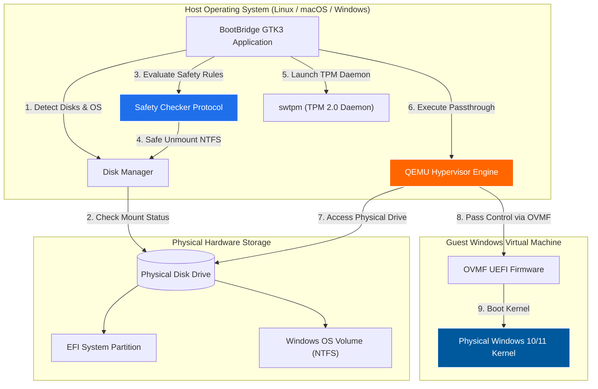

<div align="center">


# BootBridge

### *Lightweight, Safe & Zero-Reboot Physical Dual-Boot Launcher*

[](LICENSE)
[](https://www.python.org/)
[](https://www.gtk.org/)
[](https://www.qemu.org/)
[](https://github.com/dreamzz2nd/BootBridge)

<p align="center">
  <b>Languages / Bahasa:</b> <b><a href="README.md">English</a></b> | <a href="README.id.md">Bahasa Indonesia</a>
</p>

<p align="center">
  <b>BootBridge</b> is a specialized desktop application designed to safely run your existing physical dual-booted Windows installation inside a Virtual Machine (QEMU with native hardware acceleration) directly from your desktop—<b>without rebooting your computer</b>.
</p>

[Key Features](#key-features) •
[Cross-Platform Support](#cross-platform-support) •
[Installation Guide](#installation-guide) •
[Remote Desktop](#easy-remote-desktop-suite) •
[Comparison](#comparison-matrix) •
[Troubleshooting](#troubleshooting--faq)

</div>

---

## Table of Contents

- [Overview](#overview)
- [Key Features](#key-features)
- [Cross-Platform Support](#cross-platform-support)
- [Installation Guide](#installation-guide)
  - [Option A: 1-Click Graphical Setup Wizard (No-Terminal / Beginners)](#option-a-1-click-graphical-setup-wizard-no-terminal--beginners)
  - [Option B: 1-Line Automated Terminal Installer](#option-b-1-line-automated-terminal-installer)
  - [Option C: Manual Installation](#option-c-manual-installation)
- [Easy Remote Desktop Suite](#easy-remote-desktop-suite)
- [Comparison Matrix](#comparison-matrix)
- [System Architecture](#system-architecture)
- [System Requirements](#system-requirements)
- [Usage Guide](#usage-guide)
- [Troubleshooting & FAQ](#troubleshooting--faq)
- [Keyboard Shortcuts Reference](#keyboard-shortcuts-reference)
- [Contributing & License](#contributing--license)

---

## Overview

Traditionally, dual-boot users must completely shut down their OS and restart their computer to access their Windows installation. **BootBridge** eliminates this workflow friction by leveraging **native hardware hypervisors** and **QEMU raw block device passthrough**.

With BootBridge, your physical Windows partition is booted natively inside a high-performance VM window on your desktop. You retain full access to your physical Windows files, installed games, and applications while running your host OS simultaneously.

---

## Key Features

- **Zero-Reboot Dual Booting**: Boot your physical Windows drive inside your host OS at near-native speed.
- **Cross-Platform Compatibility**: Full support for **Linux**, **macOS** (Intel & Apple Silicon), and **Windows**.
- **1-Click Setup Wizard**: Double-click `Install_BootBridge.desktop` or run `gui_installer.py` for a beginner-friendly setup.
- **Easy Remote Desktop Suite**: 7-step simple remote desktop workflow with auto-generated Device ID, 1-click IP copy, Wi-Fi device auto-scanning, and 1-click connect.
- **Mount Safety Guard**: Built-in protection protocol that verifies disk mount states, warns against shared host partition access, and safely unmounts host-mounted NTFS drives to prevent data corruption.
- **Fast Startup & Offline Registry Modifier**: One-click Fast Startup enablement (`HiberbootEnabled = 1`) and reset via direct offline REGF Windows registry hive modification.
- **Frameless Window Protection**: QEMU display window runs frameless to prevent accidental VM termination.
- **Bidirectional Shared Clipboard**: Built-in `qemu-vdagent` integration for seamless text copy and paste (`Ctrl+C` / `Ctrl+V`).
- **100% Free & Lightweight**: Built with Python 3 & GTK 3 (~30–50 MB RAM, 0% CPU idle footprint). Zero heavy web-wrappers.

---

## Cross-Platform Support

BootBridge is engineered to run seamlessly across all major desktop operating systems with native hardware acceleration:

| Operating System | Hardware Hypervisor Engine | Storage Interface | Remote Desktop Client |
| :--- | :--- | :--- | :--- |
| **Linux** (Ubuntu, Debian, Fedora, Arch, Mint) | **KVM** (`-accel kvm`) | `/dev/nvme*` or `/dev/sd*` | `xfreerdp` / `spicy` |
| **macOS** (Intel & Apple Silicon M1/M2/M3/M4) | **HVF** (`-accel hvf`) | `/dev/disk*` | `freerdp` / `remote-viewer` |
| **Windows** (Windows 10 & Windows 11) | **WHPX** (`-accel whpx`) | `\\.\PhysicalDrive*` | Native `mstsc.exe` |

---

## Installation Guide

### Option A: 1-Click Graphical Setup Wizard (No-Terminal / Beginners)

1. Download & Extract the BootBridge ZIP file or repository folder.
2. Double-click the **`Install_BootBridge.desktop`** file inside the folder.
3. The **BootBridge Setup Wizard** window will pop up:
   - Select your Operating System (Linux, Windows, or macOS).
   - Click **`Install Sekarang`** (Install Now).
4. The wizard will automatically install dependencies, register the desktop shortcut, and launch BootBridge!

---

### Option B: 1-Line Automated Terminal Installer

Open your terminal, copy, and paste this single command:

```bash
git clone https://github.com/dreamzz2nd/BootBridge.git && cd BootBridge && ./install.sh
```

---

### Option C: Manual Installation

#### 1. Install System Dependencies

* **Ubuntu / Linux Mint / Debian**:
  ```bash
  sudo apt update && sudo apt install -y qemu-system-x86-64 ovmf qemu-utils swtpm freerdp2-x11 spice-client-gtk python3-gi
  ```
* **macOS (via Homebrew)**:
  ```bash
  brew install gtk+3 gobject-introspection qemu freerdp
  ```
* **Arch Linux / Manjaro**:
  ```bash
  sudo pacman -S --needed qemu-desktop ovmf qemu-img swtpm freerdp python-gobject
  ```
* **Fedora**:
  ```bash
  sudo dnf install -y qemu-system-x86 edk2-ovmf qemu-img swtpm freerdp python3-gobject
  ```

#### 2. Run BootBridge
```bash
git clone https://github.com/dreamzz2nd/BootBridge.git
cd BootBridge
./start.sh
```

---

## Easy Remote Desktop Suite

BootBridge includes an intuitive, 7-step Remote Desktop connection suite designed for effortless remote PC access:

```
+-----------------------------------------------------------------------------+
|  BootBridge Remote Desktop                                                 |
+-----------------------------------------------------------------------------+
|  [ID Komputer Anda / My ID]  192.168.1.15         [ Salin ID / Copy ]       |
+-----------------------------------------------------------------------------+
|  ID Komputer Partner:       [ 192.168.1.100                    ]          |
|  Komputer Terdeteksi Wi-Fi: [ LAPTOP-WINDOWS (192.168.1.100) v ] [ Pindai ] |
+-----------------------------------------------------------------------------+
|  [ SAMBUNGKAN SEKARANG (1-KLIK) ]                                           |
+-----------------------------------------------------------------------------+
```

### The 7-Step Remote Desktop Workflow:

1. **Step 1 & 2 (Automatic Component Setup)**: BootBridge checks required remote desktop client binaries on launch. Missing components can be installed with 1 click.
2. **Step 3 (Your Device ID)**: Your unique Device ID / IP Address is displayed at the top banner with a 1-click **Copy ID** button to share with partners.
3. **Step 4 (Connect to Remote Computer - Attended Access)**: Enter the partner's Device ID / IP address (or click **Pindai Wi-Fi** to auto-discover local Windows PCs) and click **SAMBUNGKAN SEKARANG**.
4. **Step 5 (Unattended Access Setup)**: Save Windows credentials to connect anytime without requiring manual approval at the target computer.
5. **Step 6 (Full Remote Control)**: Seamlessly control mouse, keyboard, bidirectional clipboard text copy-paste, audio passthrough, and dynamic display resolution.
6. **Step 7 (Encrypted & Secure)**: All remote desktop connections are encrypted and safe.

---

## Comparison Matrix

| Feature | Native Reboot Dual-Boot | Standard Virtual Machines | BootBridge |
| :--- | :---: | :---: | :---: |
| **Reboot Required** | Yes | No | **No** |
| **Uses Physical Installed Windows**| Yes | No (Requires duplicate OS install) | **Yes** |
| **Performance** | 100% Native | 60% - 80% Virtualized | **90% - 98% Near-Native** |
| **Cross-Platform Support** | N/A | Yes | **Yes (Linux, macOS, Windows)** |
| **Data Safety Protection** | None | N/A | **Automated Mount Protection Guard** |
| **Remote Desktop Suite** | None | Limited | **7-Step Easy Suite** |
| **RAM Footprint** | N/A | 500 MB+ (Web wrappers) | **~30 – 50 MB (Native GTK3)** |

---

## System Architecture



---

## System Requirements

| Component | Minimum Specification | Recommended Specification |
| :--- | :--- | :--- |
| **Host Operating System** | Linux, macOS (10.15+), or Windows 10/11 | Linux Mint, Ubuntu 22.04+, macOS 12+, Windows 11 |
| **CPU Virtualization** | Intel VT-x or AMD-V enabled in BIOS/UEFI | 4+ Cores CPU with Hardware Virtualization |
| **System Memory (RAM)** | 8 GB Total System RAM | 16 GB+ Total System RAM |
| **Storage Interface** | SATA SSD or HDD Dual-Boot Setup | NVMe M.2 SSD Dual-Boot Setup |

---

## Usage Guide

1. **Launch BootBridge**:
   Run `./start.sh` or double-click **`Install_BootBridge.desktop`**.

2. **Select Target Physical Disk**:
   Choose the physical drive containing your Windows installation from the **Target Disk** dropdown menu.

3. **Verify Safety Guard Status**:
   - If NTFS partitions are currently mounted, click **`Safe Unmount Linux Partitions`**.
   - If Windows was hibernated by Fast Startup, click **`Reset Status NTFS / Fast Startup`**.

4. **Launch VM**:
   Click **`START WINDOWS VM`**. The VM window will boot directly into your physical Windows desktop.

---

## Troubleshooting & FAQ

### 1. Disabling / Enabling Windows Fast Startup

> [!IMPORTANT]
> When Windows is shut down physically with **Fast Startup** enabled, Windows hibernates the kernel and locks the NTFS filesystem. Booting QEMU with a hibernated state forces Windows into an Automatic Repair loop.

**Resolution:**
- Use the built-in **`Reset Status NTFS / Fast Startup`** button in BootBridge to clear hibernation locks.
- Alternatively, boot into physical Windows and run `powercfg /h off` in CMD as Administrator.

---

## Keyboard Shortcuts Reference

| Shortcut | Function | Description |
| :--- | :--- | :--- |
| **`Ctrl + Alt + F`** | **Toggle Fullscreen** | Switches between windowed and full-screen mode |
| **`Ctrl + Alt + G`** | **Release / Grab Focus** | Releases mouse cursor and keyboard focus |
| **`F11`** | **Window Fullscreen** | Toggles BootBridge window fullscreen state |
| **`Ctrl + C` / `Ctrl + V`** | **Shared Clipboard** | Bidirectional text copy and paste |
| **`Super / Windows Key`** | **Windows Start Menu** | Captured directly by Windows VM Start Menu when focused |

---

## Contributing & License

Contributions are welcome! Please read [CONTRIBUTING.md](CONTRIBUTING.md) for details.

### License

This project is licensed under the **MIT License** - see the [LICENSE](LICENSE) file for details.

---

<div align="center">

Developed by **[Rizky Ibrahim Nasrullah (dreamzz2nd)](https://github.com/dreamzz2nd)**

*BootBridge is an independent open-source application.*

</div>
